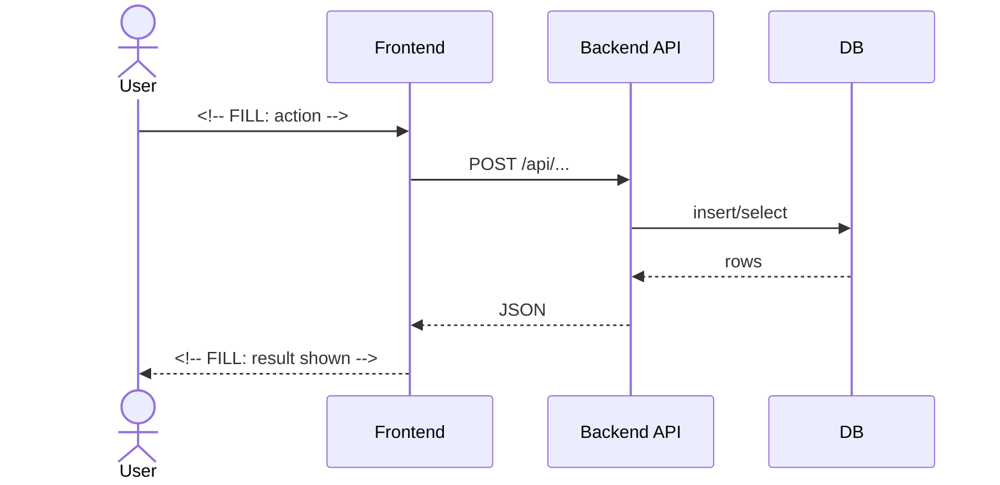

# Solution overview

Read this when: needing the end-to-end picture of how the solution works.

## What happens, in one paragraph

<!-- FILL: the core loop of the solution — inputs, processing, outputs. -->

## Main sequence

<!-- FILL: one mermaid sequence diagram per primary workflow (W-NN). Template: -->

<!-- Long-running variant: gateway enqueues a job, worker claims it (lease queue),
frontend polls status. Add when the worker service is enabled. -->
