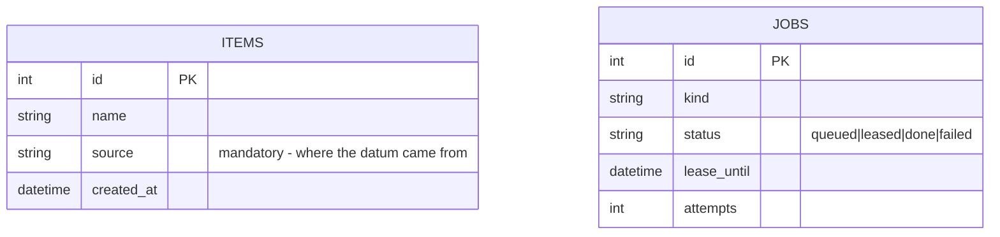

# Data schema

Read this when: adding or changing a data entity.

## Entity diagram



## Objects summary (JSON)

One canonical example per entity — the shape, not the schema DDL:

```json
{
  "item": {"id": 1, "name": "example", "source": "api:example", "created_at": "2026-08-13T12:00:00Z"}
}
```

## Definition of "wired in" — the N-places checklist

An entity is implemented only when ALL rows are done (add rows as the project grows):

| # | Where | What |
|---|---|---|
| 1 | `backend/db/migrations/versions/` | migration creating the table (with `source`) |
| 2 | `backend/app/domain/models.py` | frozen dataclass |
| 3 | `backend/app/infrastructure/persistence/repositories.py` | Sql + InMemory repositories |
| 4 | `backend/app/infrastructure/api/routes.py` | endpoints + schemas |
| 5 | `frontend/src/api/types.ts` | mirrored type |
| 6 | [02-validation-rules.md](02-validation-rules.md) | validation row |

## Expected intuitions

<!-- FILL before building: what you expect the data to look like (ranges, volumes,
distributions). Check reality against this after first ingestion; surprises → finding. -->
