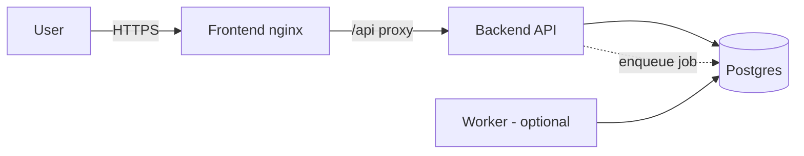

# Connections

Read this when: changing how services reach each other, the DB, or the user.

## Diagram

Keep three formats in sync: the mermaid below (source of truth), plus an exported
`diagrams/architecture.drawio` and `diagrams/architecture.png` (export via
[draw.io](https://app.diagrams.net) → File → Export; or `drawio --export`).

## Rules

- User traffic enters ONLY through the frontend (nginx proxies `/api`); the backend
  is never exposed directly in prod.
- Service→service calls use env-configured URLs (`.env.example`), never hardcoded.
- DB access only through the backend/worker — no other service gets credentials.
- <!-- FILL: auth between services (IAM invoker roles on Cloud Run / tokens) -->
